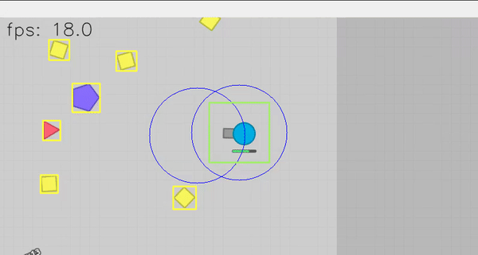
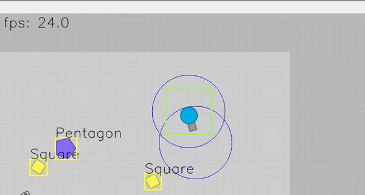
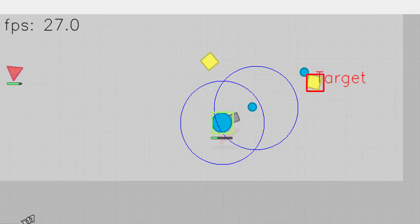

# DiepIO Bot

This a bot that plays Diep.io using Python and OpenCV

Gameplay Video: https://www.youtube.com/watch?v=730g31K6CnI&feature=youtu.be&ab_channel=ashleycheung

## Bot functions
### Collision Avoidance
The bot is able to automatically avoid collisions based on how close nearby objects are
and which direction the bot is heading

#### Object Classification
The bot is able to classify its neighbouring shapes.

#### Automatic Targetting
The bot is able to choose its best target based on certain heuristics

## Instructions

1. Clone the repository
2. Install all the required packages
3. cd to the src folder and run python3 bot.py
4. Follow the program instructions
